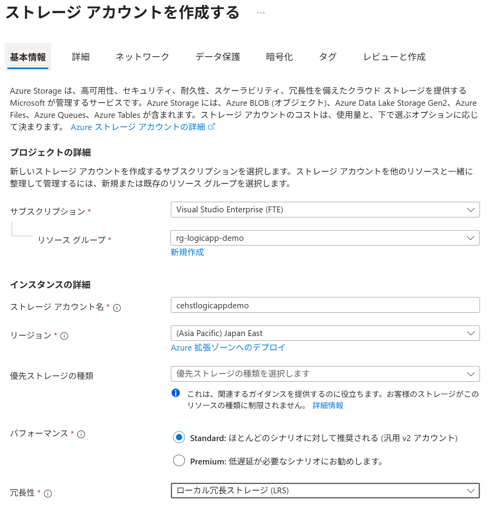
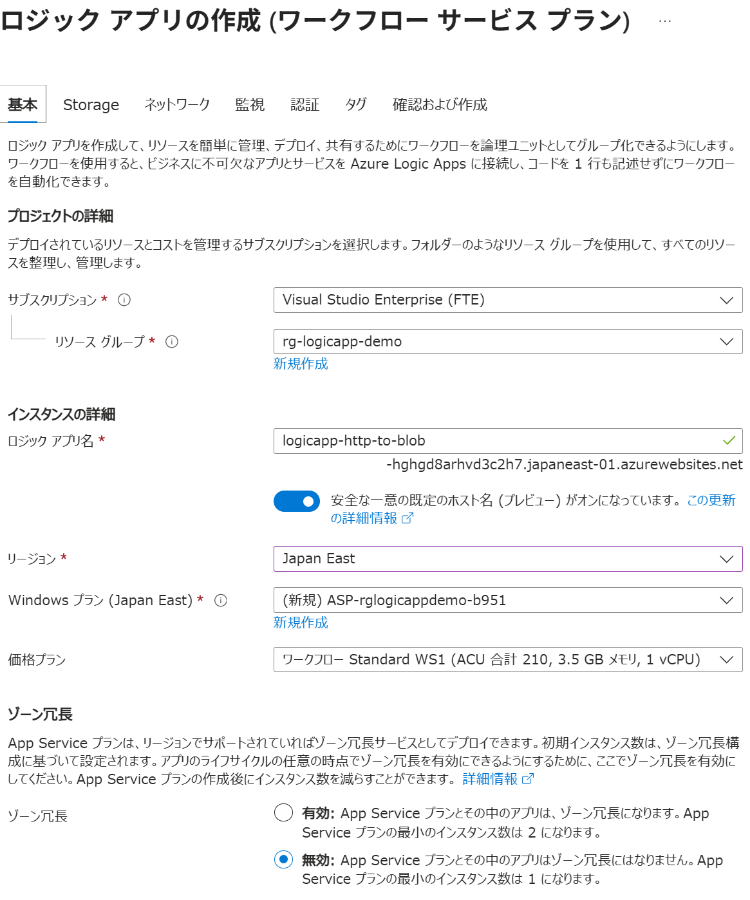

# Step 1: Logic App Standard と Storage Account の作成

## 1. Storage Account の作成
1. Azure Portal にログイン
2. **「ストレージ アカウント」** → **「作成」** を選択
3. 以下を設定:
   - 名前: `stlogicappdemo` (一意の名前に変更してください)
   - リソースグループ: `rg-logicapp-demo` (トレーニング用に払い出されたリソースグループを使用)
   - リージョン: 東日本 (Japan East)
   - パフォーマンス: Standard
   - 冗長性: LRS (ローカル冗長ストレージ)
   
4. **「レビューと作成」** をクリックし、設定を確認後 **「作成」** を選択
5. 作成 → デプロイ完了を待機
6. ストレージ アカウントが作成されたら、**「コンテナー」** へ移動し、`logicapp-container` という名前で新しいコンテナーを作成（パブリック アクセス レベルは「プライベート (匿名アクセスなし)」のままにする）
7. key1 または key2 の接続文字列をコピーしてメモしておく（Logic
 App から接続する際に使用

## 2. Logic App Standard の作成
1. **「ロジック アプリ」** → **「作成」** → **「Logic App 」** → **「Standard (ワークフロー サービス プラン)」** を選択。
2. 以下を設定:
   - 名前: `logicapp-http-to-blob`
   - リソースグループ: `rg-logicapp-demo`
   - リージョン: 東日本 (Japan East)
   - 価格プラン: **ワークフロー Standard WS1**
3. **「確認及び作成」** をクリックし、設定を確認後 **「作成」** を選択。

4. 作成 → デプロイ完了を待機。