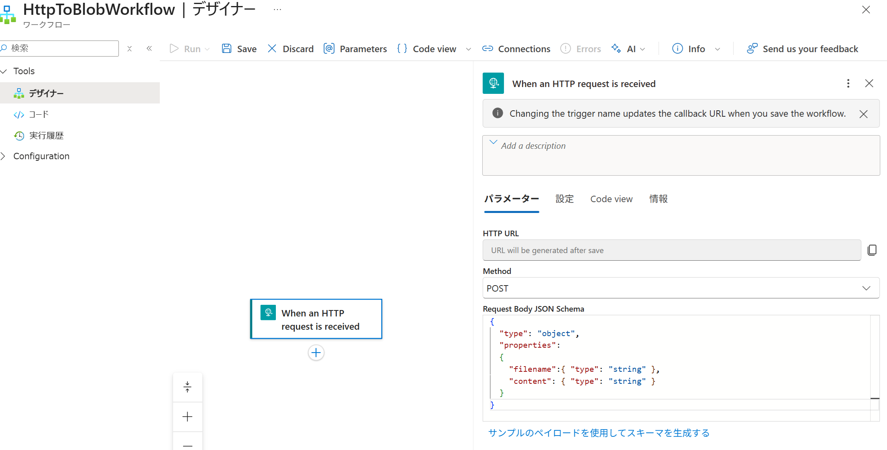

# Step 2: HTTP トリガーの追加
このステップでは、Logic App に HTTP トリガーを追加します。

1. Azure Portal でロジック アプリ (Standard) へ移動し、ワークフローから「追加」をクリックして、デザイナーを開く


2. Workflow 名を `HttpToBlobWorkflow` として、Stateful をチェックして、「作成」をクリック
3. 作成したワークフローをクリックし、デザイナーを起動して、以下を設定:
  - **「トリガーの追加」** → **「When an HTTP request is received (HTTP リクエストを受信したとき)」** を選択。
  - **メソッド**: `POST`
  - **スキーマ** (例: JSON):
  ```json
   {
     "type": "object",
     "properties":
     {
       "filename":{ "type": "string" },
       "content": { "type": "string" }
     }
   }
  ```


