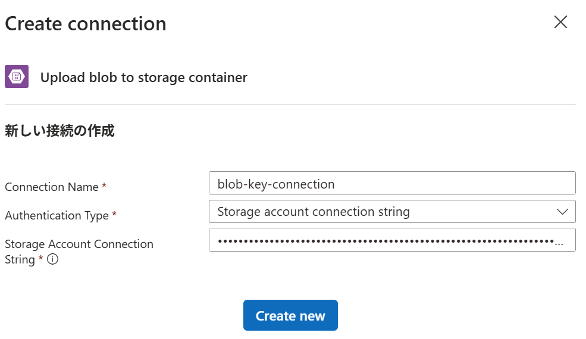
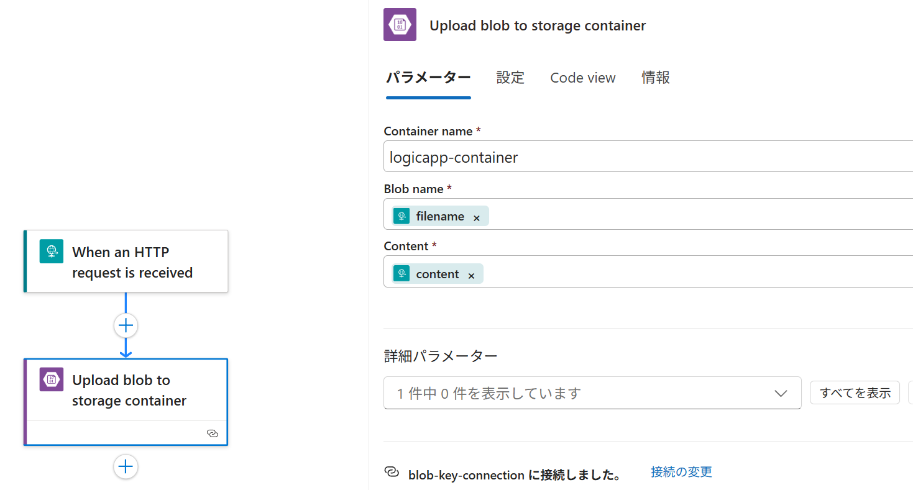
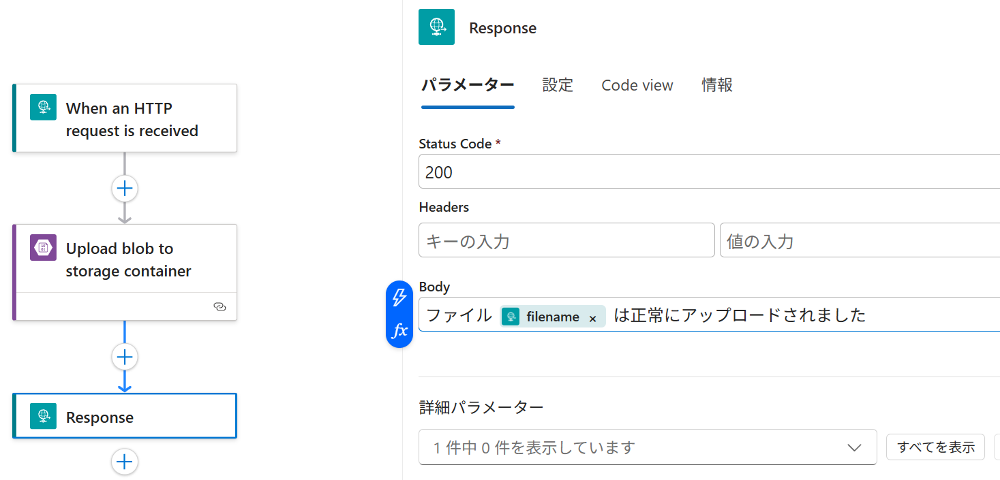

# Step 3: Blob ストレージにファイルを書き込むアクション追加

## 1. アクションの追加
1. ロジック アプリ デザイナーで **「新しいステップ」** → **「Azure Blob Storage」** → **「Upload blob to storage container」** を選択

---

## 2. 接続の作成方法
Logic App から Storage Account に接続するための認証情報を設定します。以下のいずれかの方法で接続を作成することができますが、今回は **方法 A: Storage Account キーを使用** を選択します。

### ✅ 方法 A: Storage Account キーを使用
1. Azure Portal で対象の **Storage Account** を開く。
2. **「アクセスキー」** を選択。
3. **キー1 またはキー2** をコピー。
4. ロジック アプリの接続作成画面で以下を入力:
   - **Connection Name**: 任意（例: `blob-key-connection`）
   - **Authentication Type**: `Storage account connection string`
   - **アクセスキー**: コピーした接続文字列を貼り付け
5. **「Create new」** クリックして保存し、接続を確立

### ✅ 方法 B: マネージド ID を使用
- 認証方法: **マネージド ID**
- RBAC 権限: **Storage Blob Data Contributor**
- 利点: キー管理不要、セキュリティ強化。

---

## 3. アクションのパラメータ設定
- Container name: `logicapp-container` (事前に作成)
- Blob name: `@{triggerBody()?['filename']}`
- Blob content: `@{triggerBody()?['content']}`

---

## 4. Response アクションの追加
1. **「新しいステップ」** → **「Response」** アクションを追加
2. 以下を設定:
   - Status Code: `200`
   - Body: `ファイル @{triggerBody()?['filename']} が正常にアップロードされました`

---

## 5. ワークフローの保存
1. 画面上部の **「保存」** ボタンをクリックして、ワークフローを保存
