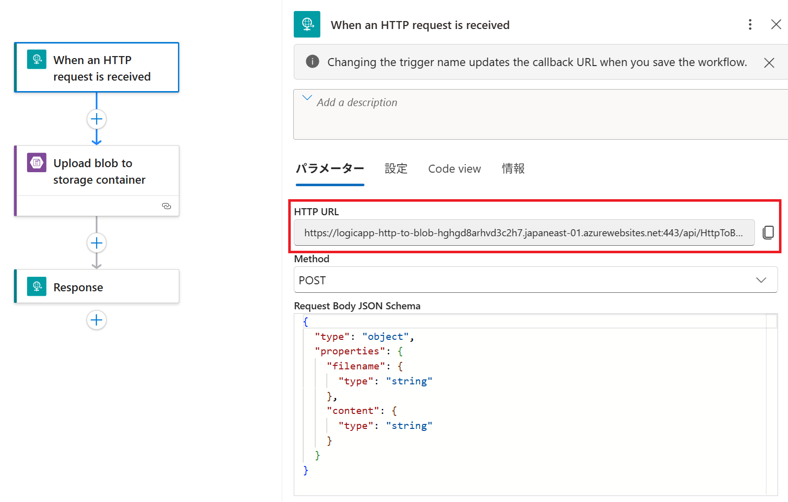

# Step 4: 動作確認
このステップでは、Logic App ワークフローが正しく動作することを確認します。PowerShell を使用して HTTP POST リクエストを送信し、Blob ストレージにファイルが作成されることを検証します。

## 1. Logic App の HTTP エンドポイントを取得
1. Azure Portal で対象の ロジック アプリ を開く
2. **「ワークフロー」** → **「HTTP トリガーをもつ対象のワークフロー」** を選択
<table><tr><td>
    
</td></tr></table>
3. トリガーの詳細画面で **「HTTP POST URL」** をコピー
   - この URL が PowerShell コマンドで使用するエンドポイント

---

## 2. PowerShell を使用して HTTP POST リクエストを送信
以下のコマンドを PowerShell で実行します。

```powershell
$uri = "<コピーした Logic App の HTTP エンドポイント>"
$body = @{
    filename = "sample.txt"
    content  = "Hello from Logic App!"
} | ConvertTo-Json

Invoke-RestMethod -Uri $uri -Method Post -Body $body -ContentType "application/json"
```

---

## 3. Blob ストレージにファイルが作成されたことを確認
1. Azure Portal で対象の **Storage Account** を開く
2. **「コンテナー」** → `logicapp-container` を選択
3. 作成された Blob (`sample.txt`) が存在することを確認
4. Blob を開き、内容が `Hello from Logic App!` であることを確認