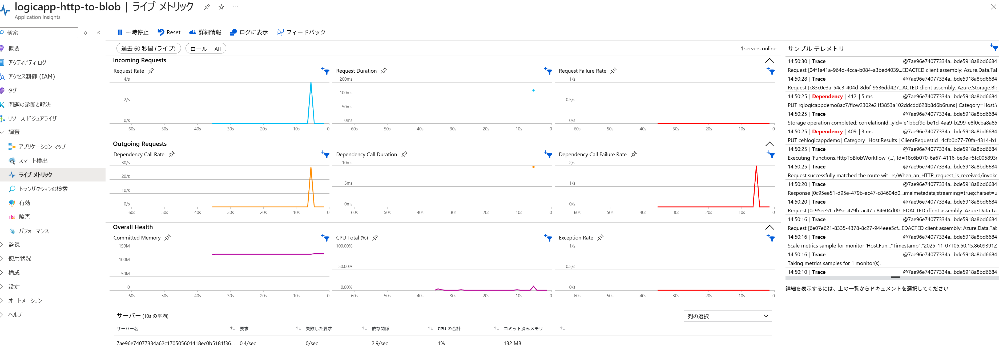
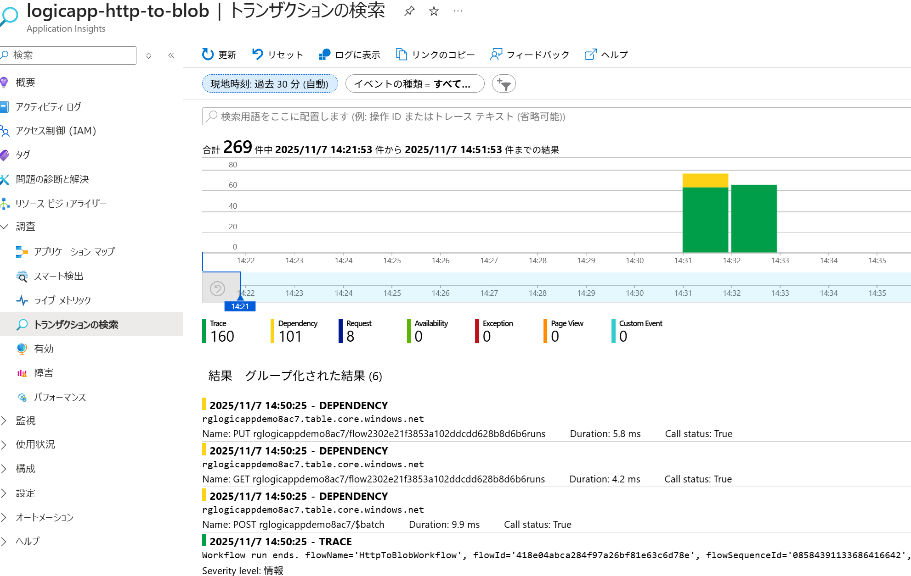
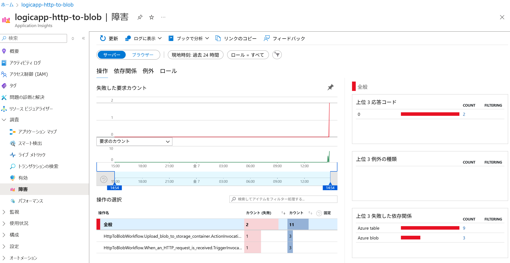

# Step 5: Application Insights による監視設定
このステップでは、Logic App Standard のワークフローで Application Insights を有効化し、監視データを収集および分析する方法を説明します。

1. ロジック アプリ の **「監視」** → **「Application Insights」** を確認
2. 有効化済みであれば、トレースや依存関係が自動的に送信される
3. **Application Insights** で確認:
   - 「ライブメトリック」: 実行状況をリアルタイムで確認
   
   - 「トランザクションの検索」: HTTP リクエストや Blob 書き込みのログを確認
   
   - 「失敗した要求」: エラーの詳細を確認
   